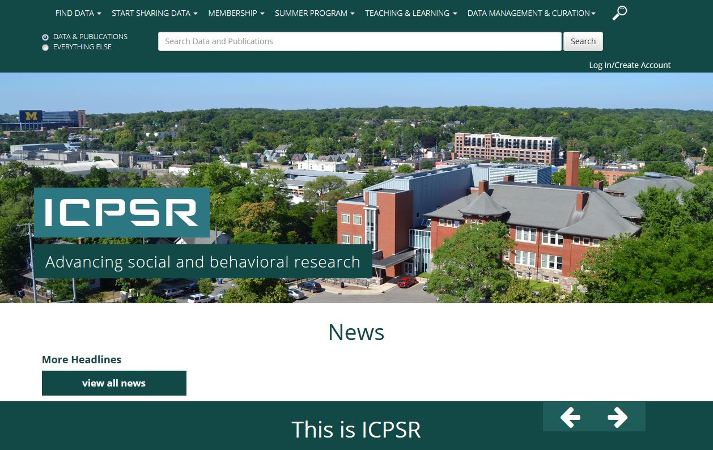
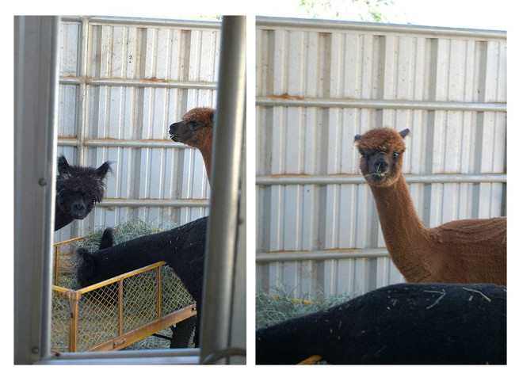

     

# Data Management for Advanced Research 
UCLA Library Data Science Center
Summer Quarter 2018

.footnote[Graduate Writing Center    Summer 2018]
---

## Today's Topics    

* UCLA Library Data Science Center (formerly Social Science Data Archive)
* The role of data in your research
* How to search for and acess data for research
* Resources, tools and support available to students at UCLA
* Publishing and Data Management Plans

.footnote[Graduate Writing Center    Summer 2018]
---

## UCLA Library Data Science Center   
#### (formally the Social Science Data Archive)
### YRL 20136, 2nd floor
* On the UCLA campus since 1961 [About the Data Archive](https://www.library.ucla.edu/social-science-data-archive/about-data-archive)  
* Bacame part of the library in 2xxx.
* Available to all UCLA faculty and students
* Holdings include public opinion polls, census data, crime stats, political and social behavior, etc.  

[https://www.library.ucla.edu/location/social-science-data-archive](https://www.library.ucla.edu/location/social-science-data-archive)  

.footnote[Graduate Writing Center    Summer 2018]
---
## Data Archive: Our services
* Reference: assist students to find and use data
* Data Management Plans
* Metadata
* Provide training: [Software/Library carpentry](https://software-carpentry.org/) / [Software Carpentry R-language](https://www.library.ucla.edu/events/software-carpentry-workshop-r-version)   
    

* Host events and lectures: [Data Archive News and Upcoming Events](https://www.library.ucla.edu/location/social-science-data-archive)   

.footnote[Graduate Writing Center    Summer 2018]
---

## Data Management Plans

A data management plan is a document that describes what you will do with your data _during_ your research and _after_ you complete your research.

.footnote[Graduate Writing Center    Summer 2018]
---

## Data Management Plans

* Funding Agencies
* Publishing  [https://dataden.library.ucla.edu/jspui/](https://dataden.library.ucla.edu/jspui/)  ORCID:[https://orcid.org/](https://orcid.org/)
* Sharing and Archiving Data
* Regardless of the requirements, good data management is an essential skill for researchers.

.footnote[Graduate Writing Center    Summer 2018]
---

## Basic Elements of a Data Management Plan  

* Data Description  
* Format(s)  
* Documentation  
* Privacy and ownership  
* Acess and sharing  
* Cost  

(ICPSR and NSF handouts)  
  
.footnote[Graduate Writing Center    Summer 2018]
---

## Getting Help with Data Management Plans

* Data Science Center / Data Archive  
* OSF  
* ICPSR  
* DMP Tool

.footnote[Graduate Writing Center    Summer 2018]
---

## Access and Sharing: Where to put data

* UCLA DataDen    
* Dataverse  
    - Data Science Center curated  
    - Self-curated   
    - Harvard Hosted  
* OSF  
* ICPSR  

.footnote[Graduate Writing Center    Summer 2018]
---

## OSF : Open Science Foundation 
#### [https://osf.io/](https://osf.io/)  
  

.footnote[Graduate Writing Center    Summer 2018]
---

## Center for Open Science
#### [https://cos.io/](https://cos.io/)  
  

* Self-deposit

.footnote[Graduate Writing Center    Summer 2018]
---

## Dataverse: Harvard Hosted
#### [https://dataverse.harvard.edu/](https://dataverse.harvard.edu/)  
  

* Self-deposit

.footnote[Graduate Writing Center    Summer 2018]
---

## UCLA DataDen
#### [https://dataden.library.ucla.edu/](https://dataden.library.ucla.edu/)  
  

* Not self depositing

.footnote[Graduate Writing Center    Summer 2018]
---

## ICPSR Data Site  
#### Inter-university Consortium for Political and Social Research [http://www.icpsr.umich.edu](http://www.icpsr.umich.edu)  
  

.footnote[Graduate Writing Center    Summer 2018]
---

## Questions?  

.footnote[Graduate Writing Center    Summer 2018]
---

## Problems ?

## The Data Archive is here to help
YRL, 2nd Floor, Room 21536 
ucla-data-archive@googlegroups.com 
310-825-0716  
Tim Dennis, Director of the Data Archive 
Jamie Jamison, Collection Manager 

.footnote[Graduate Writing Center    Summer 2018]
